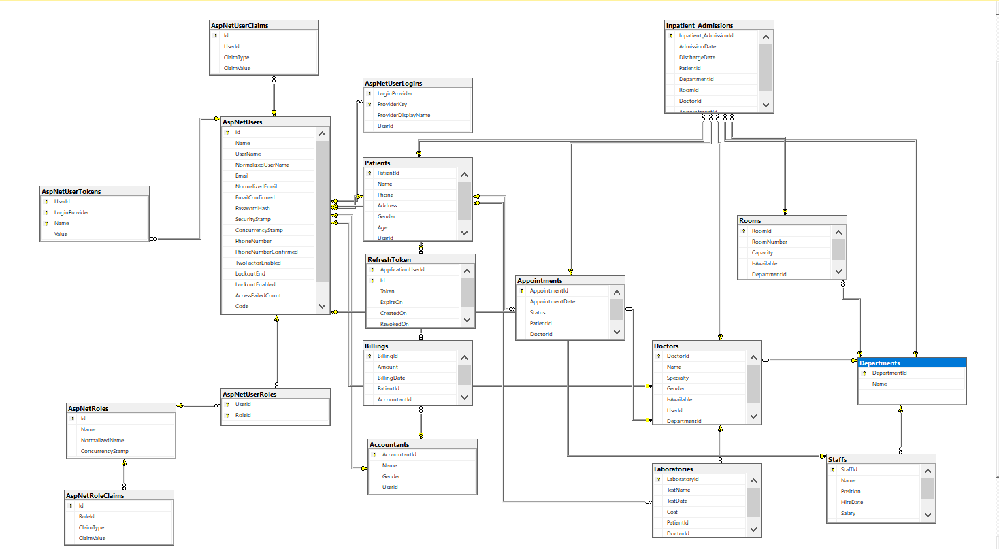
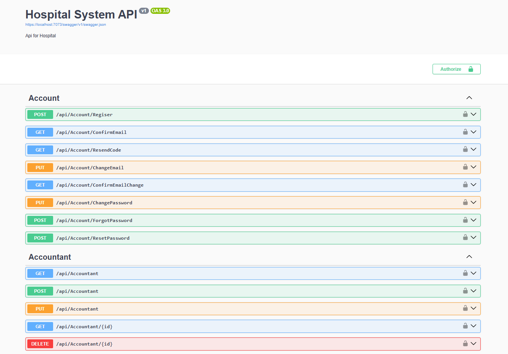
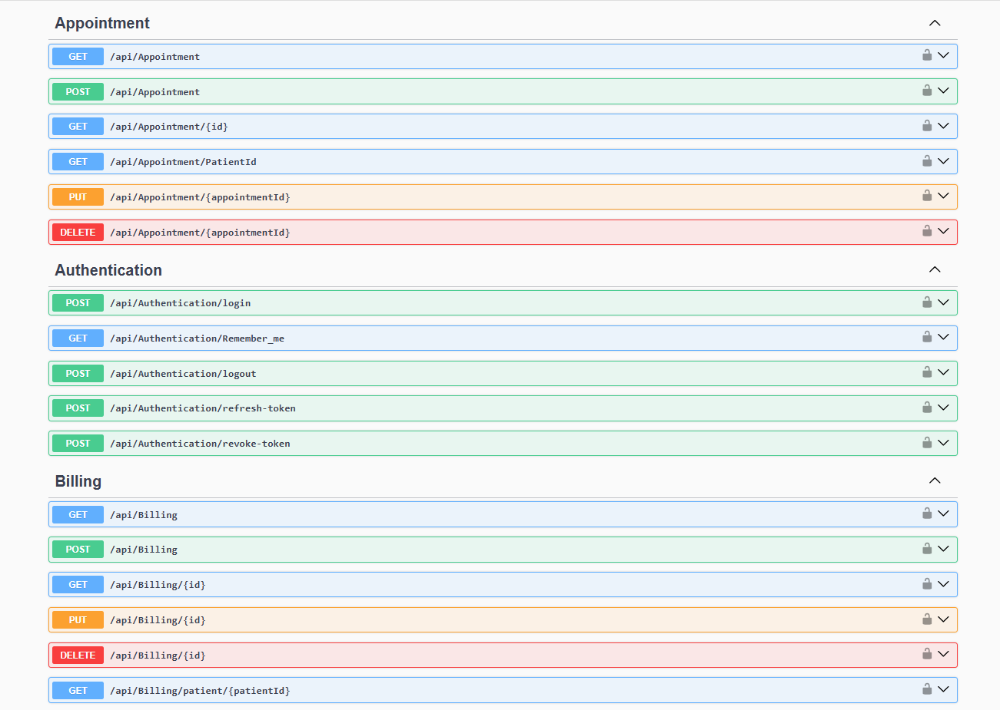
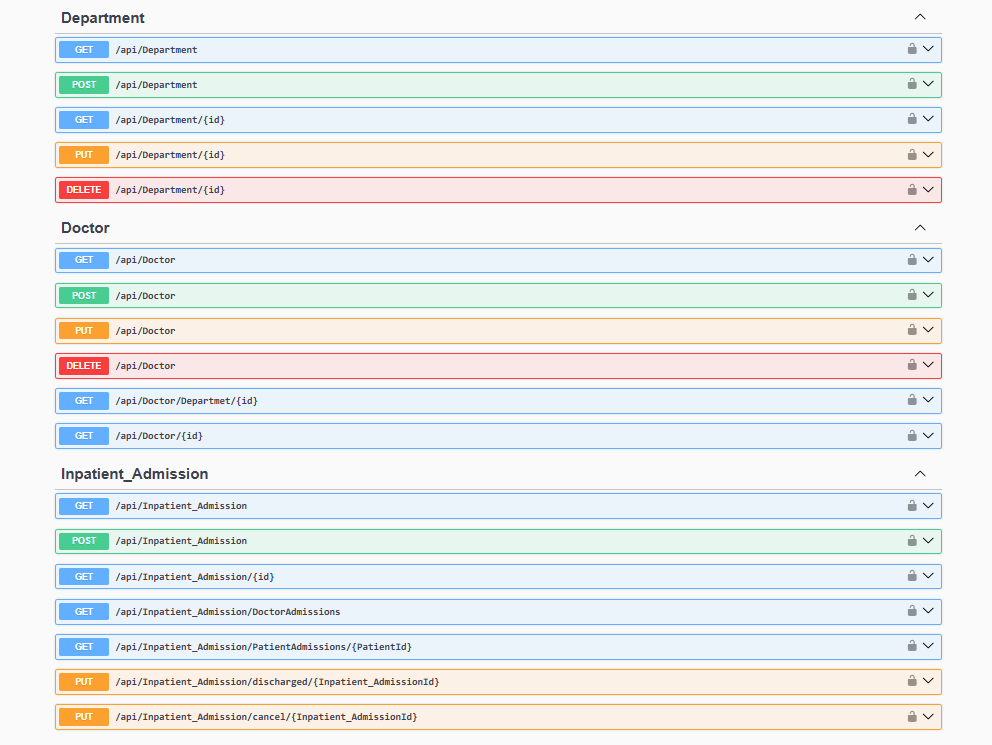
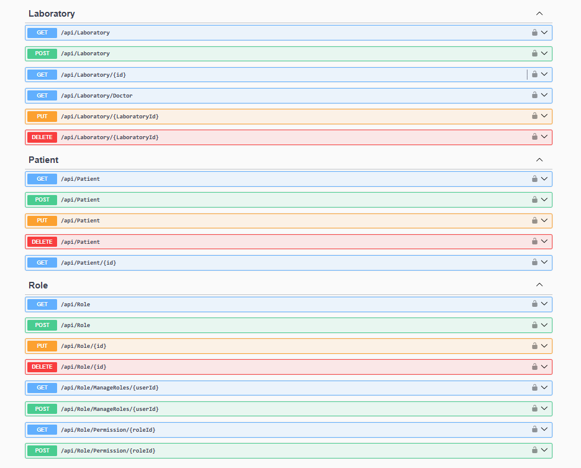
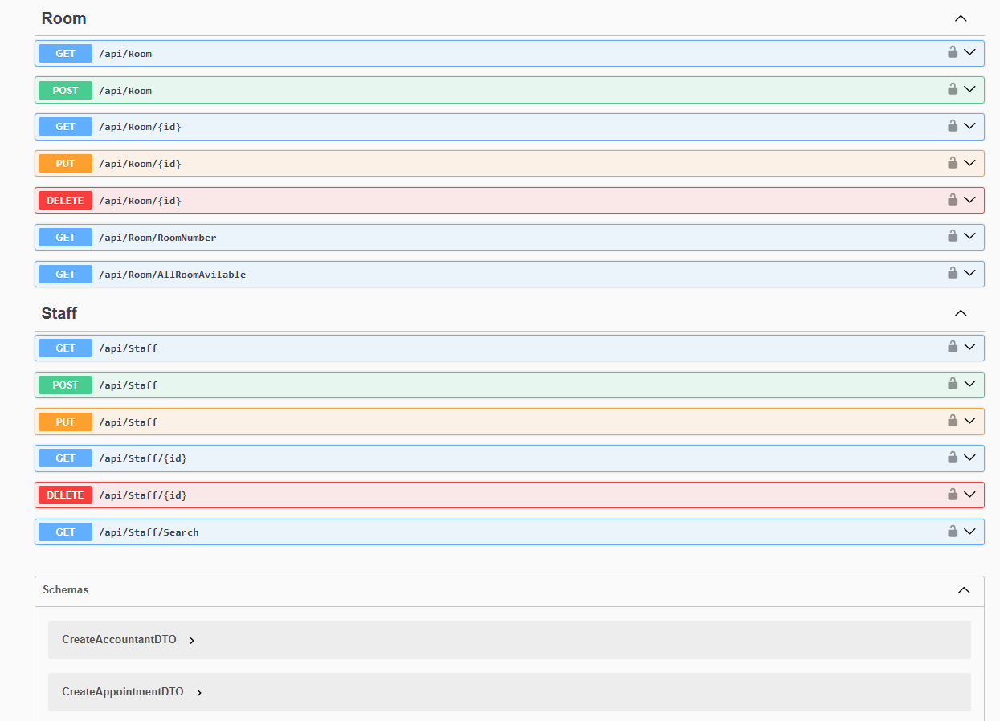

# 🏥 Hospital Management System API

Hospital Management System built using ASP.NET Core with Onion Architecture.

---

## 🚀 Features

- Authentication & Authorization (JWT + Refresh Tokens)
- Account
- ِAccountant
- Doctor
- Department
- Patient
- Appointment Scheduling
- Billing System
- Inpetion Admition
- Laboratory
- Room
- Staff 
- Role & Permission

---

## 🛠️ Technologies Used

- ASP.NET Core Web API
- Entity Framework Core
- SQL Server
- JWT Authentication
- Refresh Token
- Role-Based Authorization
- Onion Architecture

---

## 📌 Overview

- Built a scalable RESTful API using ASP.NET Core 8 and Onion Architecture using Generic Repository.
- Secured API with JWT authentication & authorization using ASP.NET Core Identity
- Designed and implemented secure account management workflows including email verification, 
  resend confirmation codes, email change validation, and password reset functionality.
- Appointment scheduling & management system (create, update, cancel, track appointments).
- Inpatient admission workflow (admit patient, discharge, cancel admission).
- Using AutoMapper integrated for mapping between entities & DTOs.
- Implemented Localization & Globalization (multi-language and culture support).

---

## 📸 Project Screenshots

## 🗄️ Database Diagram

### 👤 Account & Accountant

### 📅 Appointment, Authentication & Billing

### 🏥 Department, Doctor & Inpatient Admission

### 🧪 Laboratory, Patient & Role

### 🛏️ Room & Staff

---
